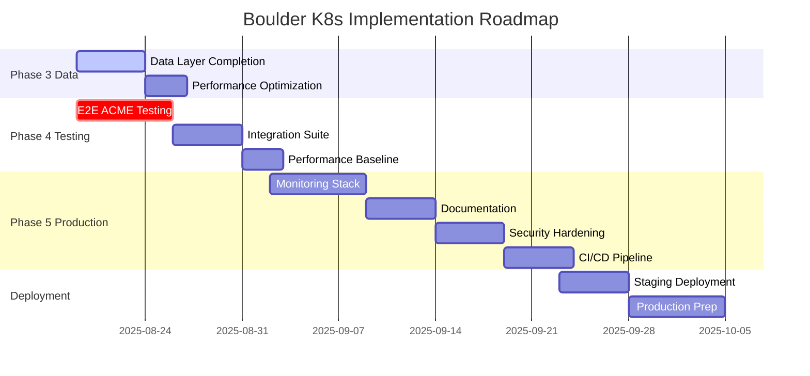

# Boulder Kubernetes Strategic Action Plan

## Executive Summary

**Document Version**: 1.0.0  
**Date**: August 18, 2025  
**Project Phase**: Transitioning from Infrastructure to Testing & Production Readiness  
**Overall Completion**: 61% (weighted by phase complexity)

### Current State Assessment

The Boulder Kubernetes deployment project has achieved significant milestones with complete core infrastructure and security foundations. With Phase 1 and 2 at 100% completion, the project has established:

- **✅ Complete Infrastructure**: All 15+ Boulder services deployed with proper networking
- **✅ Security Framework**: mTLS configuration, cert-manager integration, and security validation
- **✅ Database Automation**: Schema initialization, WebPKI certificates, and deployment pipeline
- **⚠️ Testing Gap**: End-to-end ACME validation pending
- **⚠️ Production Gap**: Monitoring, scaling, and operational procedures needed

### Strategic Priorities

1. **Immediate**: Complete end-to-end ACME protocol testing to validate core functionality
2. **Short-term**: Finalize data layer components and achieve full integration testing
3. **Medium-term**: Implement production-grade monitoring and operational capabilities
4. **Long-term**: Establish CI/CD pipeline and scaling strategies for production deployment

---

## Timeline & Milestones



---

## Week 1-2: Immediate Next Steps (Aug 19 - Sep 1, 2025)

### Priority 0 (P0) - Critical Path Tasks

#### 1. End-to-End ACME Protocol Testing
**Owner**: Testing Team  
**Effort**: 3-4 days  
**Dependencies**: Database schema, mTLS configuration  

**Acceptance Criteria**:
- [ ] HTTP-01 challenge validation successful
- [ ] DNS-01 challenge validation successful  
- [ ] TLS-ALPN-01 challenge validation successful
- [ ] Certificate issuance workflow complete (order → validation → finalization)
- [ ] Certificate revocation tested and verified
- [ ] Multi-perspective validation (MPIC) operational

**Specific Test Scenarios**:
```yaml
Test Suite:
  1. Basic Certificate Issuance:
     - Single domain certificate
     - Multi-domain (SAN) certificate
     - Wildcard certificate (DNS-01 only)
  
  2. Challenge Validation:
     - HTTP-01 with redirect following
     - DNS-01 with CNAME support
     - TLS-ALPN-01 with SNI routing
     - Mixed challenge types
  
  3. Error Scenarios:
     - Invalid challenge responses
     - Timeout handling
     - Rate limit enforcement
     - Authorization reuse
  
  4. Revocation Testing:
     - Key compromise scenario
     - Certificate replacement
     - CRL/OCSP alternative validation
```

#### 2. Database Performance Validation
**Owner**: Data Team  
**Effort**: 2 days  
**Dependencies**: Database initialization complete  

**Acceptance Criteria**:
- [ ] ProxySQL connection pooling operational
- [ ] Read/write splitting verified for SA service
- [ ] Query performance baseline established
- [ ] Connection limits tested under load
- [ ] Failover scenarios validated

**Validation Checkpoints**:
- Connection pool efficiency > 80%
- Query latency P99 < 100ms
- Transaction throughput > 1000 TPS
- Zero data loss during failover

#### 3. Service Health Verification
**Owner**: Infrastructure Team  
**Effort**: 2 days  
**Dependencies**: All services deployed  

**Acceptance Criteria**:
- [ ] All health endpoints responding
- [ ] Service discovery functional
- [ ] Inter-service communication verified
- [ ] Resource utilization within limits
- [ ] Graceful shutdown procedures tested

### Priority 1 (P1) - Essential Tasks

#### 4. DNS Service Configuration
**Owner**: Network Team  
**Effort**: 3 days  
**Dependencies**: Network policies  

**Tasks**:
- [ ] Configure DNS-over-HTTPS for VA services
- [ ] Implement DNS caching strategy
- [ ] Set up fallback DNS resolvers
- [ ] Test DNSSEC validation
- [ ] Configure CAA record checking

#### 5. Redis Optimization
**Owner**: Data Team  
**Effort**: 2 days  
**Dependencies**: Redis deployment  

**Tasks**:
- [ ] Configure Redis Cluster mode
- [ ] Implement rate limiting data structures
- [ ] Set up Redis Sentinel for HA
- [ ] Configure persistence (AOF/RDB)
- [ ] Test cache invalidation patterns

---

## Week 3-4: Short-term Goals (Sep 2-15, 2025)

### Phase 3 Completion (Data Layer - 25% Remaining)

#### 1. Advanced Database Features
**Priority**: P0  
**Effort**: 5 days  

**Deliverables**:
- [ ] Automated backup procedures with verification
- [ ] Point-in-time recovery testing
- [ ] Database monitoring dashboards
- [ ] Slow query optimization
- [ ] Index performance tuning

#### 2. Data Security Hardening
**Priority**: P1  
**Effort**: 3 days  

**Deliverables**:
- [ ] Encrypted connections for all database traffic
- [ ] Audit logging implementation
- [ ] Secret rotation automation
- [ ] Database firewall rules
- [ ] Compliance validation (FIPS, etc.)

### Phase 4 Advancement (Integration Testing to 100%)

#### 3. Comprehensive Test Suite
**Priority**: P0  
**Effort**: 7 days  

**Test Categories**:
```yaml
Integration Tests:
  API Tests:
    - ACME protocol compliance (RFC 8555)
    - Rate limiting verification
    - Account management workflows
    - Order processing pipelines
  
  Security Tests:
    - mTLS validation between services
    - Certificate chain verification
    - Key rotation procedures
    - Authentication/authorization flows
  
  Performance Tests:
    - Concurrent certificate requests (target: 100/sec)
    - Database connection pooling
    - Redis cache hit rates (target: > 95%)
    - Service latency benchmarks
```

#### 4. Performance Baseline
**Priority**: P1  
**Effort**: 3 days  

**Metrics to Establish**:
- Certificate issuance latency (P50, P90, P99)
- Validation challenge completion time
- System resource utilization patterns
- Database query performance profiles
- Network throughput capabilities

---

## Week 5-8: Medium-term Objectives (Sep 16 - Oct 13, 2025)

### Phase 5: Production Readiness (75% Remaining)

#### 1. Monitoring & Observability Stack
**Priority**: P0  
**Effort**: 10 days  

**Implementation Plan**:
```yaml
Week 5-6:
  Metrics Collection:
    - Deploy Prometheus operator
    - Configure service discovery
    - Set up metric exporters
    - Implement custom Boulder metrics
  
  Visualization:
    - Deploy Grafana
    - Import Boulder dashboards
    - Create SLO/SLI dashboards
    - Build executive dashboards

Week 7:
  Alerting:
    - Configure AlertManager
    - Define alert rules (P1-P4)
    - Set up PagerDuty integration
    - Implement escalation policies
  
  Tracing:
    - Deploy Jaeger operator
    - Instrument Boulder services
    - Configure sampling strategies
    - Create trace analysis dashboards
```

#### 2. Documentation Completion
**Priority**: P1  
**Effort**: 5 days  

**Documentation Deliverables**:
- [ ] Production deployment guide
- [ ] Operational runbooks
- [ ] Troubleshooting playbooks
- [ ] API reference documentation
- [ ] Architecture decision records (ADRs)
- [ ] Security compliance documentation

#### 3. Security Hardening
**Priority**: P0  
**Effort**: 7 days  

**Security Tasks**:
```yaml
Infrastructure Security:
  - Pod Security Standards enforcement
  - Network segmentation verification
  - RBAC audit and refinement
  - Secret management hardening
  - Image vulnerability scanning

Application Security:
  - Input validation testing
  - Rate limiting verification
  - DDoS protection testing
  - Security headers validation
  - Compliance scanning (CIS, NIST)
```

---

## Week 9-12: Long-term Vision (Oct 14 - Nov 10, 2025)

### Production Deployment Preparation

#### 1. CI/CD Pipeline Integration
**Priority**: P1  
**Effort**: 8 days  

**Pipeline Components**:
```yaml
GitHub Actions Workflow:
  PR Pipeline:
    - Linting and validation
    - Unit test execution
    - Security scanning
    - Integration test subset
  
  Main Pipeline:
    - Full test suite execution
    - Container image building
    - Image signing and scanning
    - Staging deployment
    - Smoke test validation
  
  Release Pipeline:
    - Version tagging
    - Changelog generation
    - Production deployment
    - Post-deployment validation
```

#### 2. Disaster Recovery Procedures
**Priority**: P0  
**Effort**: 5 days  

**DR Components**:
- [ ] Backup verification procedures
- [ ] Recovery time objective (RTO) testing
- [ ] Recovery point objective (RPO) validation
- [ ] Failover automation scripts
- [ ] Multi-region deployment strategy

#### 3. Scaling Strategy
**Priority**: P1  
**Effort**: 5 days  

**Scaling Implementation**:
```yaml
Horizontal Scaling:
  - HPA configuration for all services
  - Load testing to determine thresholds
  - Auto-scaling validation
  - Resource quota management

Vertical Scaling:
  - Resource limit optimization
  - Performance profiling
  - Cost optimization analysis
  - Capacity planning models
```

---

## Risk Assessment & Mitigation

### Critical Risks (P0)

| Risk | Probability | Impact | Mitigation Strategy | Owner |
|------|------------|--------|-------------------|--------|
| Database schema incompatibility | Medium | High | Validate against Boulder source; maintain schema versioning | Data Team |
| mTLS misconfiguration causing service failures | Low | Critical | Comprehensive testing; automated validation scripts | Security Team |
| Performance degradation under load | Medium | High | Load testing; performance baselines; scaling policies | Performance Team |
| Security vulnerability in dependencies | Medium | High | Regular scanning; automated updates; security advisories | Security Team |

### Major Risks (P1)

| Risk | Probability | Impact | Mitigation Strategy | Owner |
|------|------------|--------|-------------------|--------|
| Integration test failures | Medium | Medium | Incremental testing; service mocking; rollback procedures | QA Team |
| Documentation gaps | High | Medium | Documentation-as-code; review cycles; user feedback | Tech Writers |
| Resource constraints in production | Low | Medium | Capacity planning; auto-scaling; resource monitoring | Ops Team |
| Compliance requirements changes | Low | Medium | Regular compliance audits; flexible architecture | Compliance Team |

### Contingency Plans

1. **Service Failure**: Automated rollback procedures with < 5 minute RTO
2. **Data Corruption**: Point-in-time recovery with < 1 hour RPO
3. **Security Breach**: Incident response plan with 15-minute activation
4. **Performance Issues**: Traffic shaping and gradual rollout capabilities

---

## Resource Requirements

### Infrastructure Resources

```yaml
Development Environment:
  Compute:
    - Kind cluster with 8 nodes minimum
    - 32GB RAM total capacity
    - 500GB SSD storage
  
  Testing:
    - Dedicated testing cluster
    - Load generation infrastructure
    - Network simulation tools

Production Environment:
  Compute:
    - Kubernetes 1.28+ cluster
    - Multi-AZ deployment
    - 100+ vCPU capacity
    - 256GB+ RAM capacity
  
  Storage:
    - 2TB+ persistent storage
    - SSD-backed database storage
    - Backup storage (3x primary)
  
  Network:
    - Load balancer capacity
    - DDoS protection
    - CDN integration
```

### Tools & Software

```yaml
Required Tools:
  Development:
    - kubectl 1.28+
    - helm 3.12+
    - kubeconform
    - kubeval
    - stern (log aggregation)
  
  Testing:
    - k6 (load testing)
    - Certbot (ACME testing)
    - curl/httpie
    - dig/nslookup
  
  Monitoring:
    - Prometheus 2.45+
    - Grafana 10+
    - Jaeger 1.48+
    - AlertManager 0.26+
  
  Security:
    - Trivy (vulnerability scanning)
    - Falco (runtime security)
    - OPA (policy enforcement)
```

### Team Resources

```yaml
Required Expertise:
  - Kubernetes Administrator (2 FTE)
  - Security Engineer (1 FTE)
  - Database Administrator (1 FTE)
  - DevOps Engineer (2 FTE)
  - QA Engineer (1 FTE)
  - Technical Writer (0.5 FTE)
```

### Documentation Requirements

1. **Technical Documentation**
   - Architecture diagrams (C4 model)
   - API specifications (OpenAPI)
   - Database schemas (ERD)
   - Network topology diagrams

2. **Operational Documentation**
   - Deployment procedures
   - Monitoring playbooks
   - Incident response guides
   - Disaster recovery plans

3. **User Documentation**
   - Getting started guide
   - Configuration reference
   - Troubleshooting guide
   - FAQ section

---

## Success Criteria

### Phase Completion Metrics

| Phase | Success Criteria | Target Date | Status |
|-------|-----------------|-------------|---------|
| Phase 3 (Data) | 100% schema deployed, performance validated | Sep 1, 2025 | 75% |
| Phase 4 (Testing) | 100% test coverage, all scenarios passing | Sep 15, 2025 | 50% |
| Phase 5 (Production) | Monitoring operational, documentation complete | Oct 13, 2025 | 25% |

### Key Performance Indicators (KPIs)

```yaml
Operational KPIs:
  - Service Availability: > 99.9%
  - Certificate Issuance Latency: < 5 seconds (P99)
  - Validation Success Rate: > 98%
  - System Error Rate: < 0.1%

Performance KPIs:
  - Throughput: > 100 certificates/second
  - Database Query Latency: < 50ms (P95)
  - API Response Time: < 200ms (P95)
  - Resource Utilization: < 70% (steady state)

Quality KPIs:
  - Test Coverage: > 80%
  - Security Vulnerability Count: 0 critical, < 5 high
  - Documentation Coverage: 100%
  - Deployment Success Rate: > 95%
```

---

## Implementation Priority Matrix

```
High Impact / Low Effort (DO FIRST):
  ✓ E2E ACME testing
  ✓ Database performance validation
  ✓ Service health verification

High Impact / High Effort (PLAN CAREFULLY):
  ✓ Monitoring stack deployment
  ✓ Security hardening
  ✓ CI/CD pipeline

Low Impact / Low Effort (QUICK WINS):
  ✓ Documentation updates
  ✓ Configuration optimization
  ✓ Tool installation

Low Impact / High Effort (DEFER):
  ✓ Advanced features
  ✓ Nice-to-have optimizations
  ✓ Experimental capabilities
```

---

## Communication Plan

### Stakeholder Updates
- **Weekly**: Progress report with metrics
- **Bi-weekly**: Technical deep-dive sessions
- **Monthly**: Executive summary and timeline review

### Team Coordination
- **Daily**: Stand-up meetings (15 min)
- **Weekly**: Technical planning session (1 hour)
- **Sprint**: Retrospective and planning (2 hours)

---

## Appendix A: Quick Reference Commands

```bash
# Deployment verification
make deploy-all
make test-integration
./k8s/scripts/validate-security.sh

# Performance testing
k6 run tests/load/certificate-issuance.js
k6 run tests/stress/validation-challenges.js

# Monitoring
kubectl port-forward -n monitoring svc/prometheus 9090:9090
kubectl port-forward -n monitoring svc/grafana 3000:3000

# Troubleshooting
stern -n boulder -l app=boulder --since 1h
kubectl logs -n boulder -l component=wfe2 --tail=100
```

---

## Appendix B: Decision Log

| Date | Decision | Rationale | Impact |
|------|----------|-----------|--------|
| Aug 18, 2025 | Exclude OCSP functionality | Deprecated in Boulder | Reduced complexity |
| Aug 18, 2025 | Use cert-manager for TLS | Industry standard | Simplified management |
| Aug 18, 2025 | Implement mTLS for all services | Security requirement | Enhanced security |

---

*This action plan is a living document and should be updated weekly to reflect progress and adjust priorities based on emerging requirements and discoveries.*