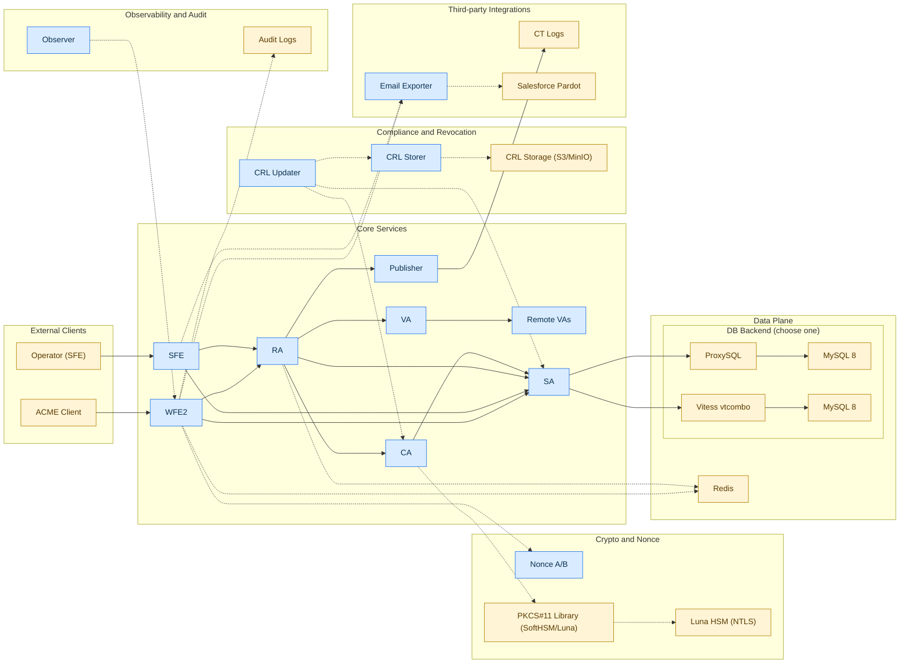

# Boulder Kubernetes Reference Implementation

A reference implementation for deploying [Boulder](https://github.com/letsencrypt/boulder) (the ACME CA software) to Kubernetes.

## Overview

This repository provides production-grade Kubernetes manifests for deploying Boulder, supporting:

- **Dev/CI**: Local development with kind clusters
- **Planned Staging**: Production-like testing environments (Phase 2)
- **Planned Production**: Full HA deployments with Luna HSM support (Phase 2+)

Supported database architectures:
- **ProxySQL + MySQL 8** (default)
- **Vitess + MySQL 8** (alternative)

## Architecture



Solid arrows: primary RPC/data flow. Dashed arrows: supporting paths (security, compliance, observability, integrations).
Blue boxes: Boulder-supplied services (from `k8s/base/boulder`). Amber boxes: external systems/dependencies.
Phase 1 dev/CI uses Jaeger for distributed tracing (OTLP on port 4317). Audit log events use `[AUDIT]` from Boulder's shared logger and can be asserted in tests. Access Jaeger UI via `kubectl port-forward svc/jaeger 16686:16686 -n boulder`.

## Quick Start

### Prerequisites

- docker
- kubectl
- helm 3.x
- kind (for local development)

### Local Development

```bash
# 1. Create kind cluster (3 nodes + cert-manager)
./scripts/kind-create.sh

# 2. Build Boulder image and load into kind
./scripts/build-images.sh

# 3. Deploy Boulder (Redis, PKI ceremony, all services)
./scripts/deploy.sh dev

# 4. Wait for services to be ready
./scripts/wait-ready.sh

# 5. Verify deployment
kubectl get pods -n boulder | grep -c "1/1.*Running"  # Expect 20+
```

### Verify ACME Endpoints

```bash
# Test certificate issuance
./scripts/test-issuance.sh

# Or manually check the directory endpoint
WFE_IP=$(kubectl get svc boulder-wfe2 -n boulder -o jsonpath='{.spec.clusterIP}')
kubectl run acme-test --rm -it --restart=Never --image=curlimages/curl -n boulder -- \
  curl -sk "https://${WFE_IP}:4431/directory"
```

### Validate Manifests (No Cluster Required)

```bash
./scripts/validate-manifests.sh
```

### Cleanup

```bash
# Remove Boulder resources (keep cluster)
./scripts/teardown.sh

# Remove everything including cluster
DELETE_CLUSTER=true ./scripts/teardown.sh
```

## Repository Structure

```
boulder-k8s/
├── boulder/                 # Boulder submodule (for reference)
├── helm/                    # Helm values files
│   └── redis/               # Redis values
├── k8s/
│   ├── base/                # Kustomize base manifests
│   │   ├── boulder/         # Boulder service deployments
│   │   ├── bootstrap/       # DB migration, PKI ceremony
│   │   ├── cronjobs/        # Compliance jobs
│   │   ├── network-policies/
│   │   └── observability/   # ServiceMonitors
│   ├── components/          # Reusable database components
│   │   ├── db-proxysql/     # MySQL 8 + ProxySQL
│   │   └── db-vitess/       # Vitess alternative
│   └── overlays/
│       ├── dev/             # Kind + SoftHSM + ProxySQL (default)
│       │   ├── config/      # Boulder configs
│       │   ├── patches/     # Dev-specific patches
│       │   ├── ceremony/    # PKI ceremony job
│       │   ├── mocks/       # Test mock services
│       │   └── secrets/     # Dev secrets
│       ├── dev-vitess/      # Kind + SoftHSM + Vitess
├── scripts/                 # Deployment scripts
└── docs/                    # Documentation
```

Planned overlays: `k8s/overlays/staging` and `k8s/overlays/prod` (see `docs/design.md` Phase 2).

## Components

### Boulder Services

| Service | Description |
|---------|-------------|
| wfe2 | Web Front End - ACME API |
| ra | Registration Authority |
| sa | Storage Authority |
| ca | Certificate Authority |
| va | Validation Authority |
| rva1-3 | Remote Validation Authorities |
| publisher | CT log publisher |
| nonce-a/b | Nonce services |
| crl-updater | CRL generation |
| crl-storer | CRL storage |
| observer | Health monitoring |
| email-exporter | Salesforce integration |
| sfe | Self-service frontend |

Email exporter is optional; when enabled, WFE2/SFE send contact/case data to Salesforce/Pardot.

### Compliance CronJobs

| Job | Schedule | Purpose |
|-----|----------|---------|
| bad-key-revoker | Every 6h | Revoke certs with compromised keys |
| log-validator | Every 1h | Validate Boulder logs |
| cert-checker | Every 4h | Verify issued certificates |
| crl-checker | Every 1h | Validate CRLs |

## Configuration

### Environment Overlays

| Aspect | Dev | Staging | Prod |
|--------|-----|---------|------|
| Database | MySQL + ProxySQL | Managed MySQL | Managed MySQL |
| HSM | SoftHSM sidecar | SoftHSM or Luna | Luna |
| CT logs | Mock | Mock | Real |
| Secrets | K8s Secrets | K8s or ESO | ESO |
| Replicas | 1 | 2+ | HA |

Only `dev` and `dev-vitess` overlays are implemented today; staging/prod are planned (Phase 2).

### Database Configuration

Two database backends available via Kustomize overlays:

Upstream Boulder is transitioning from ProxySQL + MariaDB (MariaDB-specific SQL) to Vitess + MySQL 8. This repo supports both architectures; the ProxySQL path here runs on MySQL 8.4.

| Overlay | Backend | Use Case |
|---------|---------|----------|
| `k8s/overlays/dev` | MySQL 8 + ProxySQL | Default; typical scale (<10M certs/month) |
| `k8s/overlays/dev-vitess` | Vitess | Extreme scale or existing Vitess expertise |

```bash
kubectl kustomize k8s/overlays/dev        # ProxySQL (default)
kubectl kustomize k8s/overlays/dev-vitess # Vitess
```

**MySQL + ProxySQL (default):**
- MySQL 8.4 single instance with init scripts
- ProxySQL 2.7.2 for connection pooling
- Boulder services connect to `proxysql:6033`
- Aligned with upstream Boulder's docker-compose architecture

**Vitess:**
- Vitess vtcomboserver (MySQL-compatible)
- Boulder services connect to `vitess:3306`
- Horizontal sharding for extreme scale (10M+ certs/month)

**Production:**
- Managed MySQL (RDS, Cloud SQL) or replicated MySQL
- ProxySQL for connection pooling and read/write splitting

### HSM Configuration

**Dev/CI (SoftHSM):**
- SoftHSM runs as sidecar container in CA pod
- PKI ceremony generates keys using Boulder's `ceremony` tool
- Tokens stored in K8s Secret, restored by init container

**Production (Luna HSM):**
- Mount Luna client library (`libCryptoki2.so`)
- Configure NTLS connection to Luna appliances
- Key ceremony performed manually with HSM admin

## CI/CD

GitHub Actions runs on every PR:

1. **test-proxysql** - Build images, deploy kind, run issuance tests (default overlay)
2. **validate-manifests** - Validate manifests with kubeconform

Manual-only:
- **test-vitess** - dev-vitess overlay; disabled in push/PR due to hosted runner resource constraints

## Documentation

- [Design](docs/design.md) — Goals, requirements, architecture decisions
- [Boulder](https://github.com/letsencrypt/boulder) — Upstream ACME CA

## Contributing

1. Fork the repository
2. Create a feature branch
3. Make changes
4. Run `./scripts/validate-manifests.sh`
5. Submit a pull request

## License

See [Boulder's license](https://github.com/letsencrypt/boulder/blob/main/LICENSE.txt).
