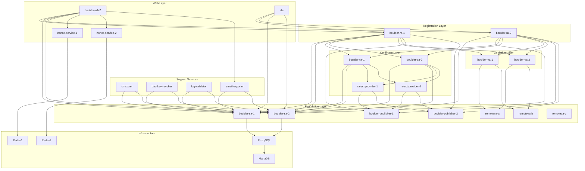
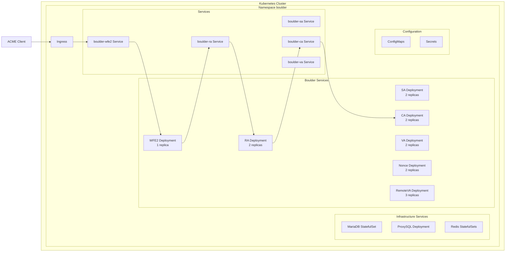

# Boulder Kubernetes Architecture Overview

## Executive Summary

This document provides a comprehensive architectural design for deploying Let's Encrypt's Boulder ACME CA to Kubernetes. Boulder's microservice architecture, consisting of 15+ specialized services, will be containerized and orchestrated using Kubernetes native patterns while maintaining full ACME protocol compliance and passing all integration tests.

## Important: OCSP Functionality Exclusion

**⚠️ CRITICAL NOTICE**: This Kubernetes implementation **excludes all OCSP-related functionality** as it is deprecated in Boulder and slated for removal.

### Excluded OCSP Services

The following Boulder OCSP services are **NOT** included in this deployment:

- **OCSP Responder** - HTTP service for OCSP status requests
- **OCSP Generator** - Background service generating OCSP responses
- **OCSP Updater** - Service updating OCSP response data
- **Akamai Purger** - CDN purging service for OCSP responses

### Why OCSP is Excluded

1. **Officially Deprecated**: OCSP functionality is deprecated upstream in Boulder
2. **Planned Removal**: OCSP services are scheduled for complete removal from Boulder
3. **Modern Alternatives**: Certificate Transparency (CT) logs provide better transparency
4. **Simplified Operations**: Reduces deployment complexity and maintenance overhead

### Impact on Architecture

- Certificate Authority service configuration omits OCSP response generation
- Database schema excludes OCSP-related tables and operations
- No OCSP-related network endpoints or ingress configurations
- Monitoring and alerting excludes OCSP-specific metrics

**Note**: This exclusion does not impact core ACME certificate issuance functionality.

## Boulder Microservices Breakdown

### Core ACME Services

Boulder implements the ACME protocol through a distributed microservice architecture with clear separation of concerns:

#### 1. Web Front End (WFE2)
- **Purpose**: Public-facing ACME API endpoint
- **Responsibilities**:
  - Receives and validates all ACME client requests
  - Handles nonce management for replay protection
  - Enforces rate limiting via Redis
  - Routes requests to appropriate backend services
- **External Access**: Yes (via Ingress)
- **Port**: 4001 (HTTP), 4431 (HTTPS)

#### 2. Registration Authority (RA)
- **Purpose**: Orchestrates certificate issuance workflow
- **Responsibilities**:
  - Manages ACME account creation and updates
  - Coordinates validation challenges
  - Enforces issuance policies
  - Determines authorization for certificate issuance
- **Instances**: 2 (boulder-ra-1, boulder-ra-2)
- **Port**: 9394, 9494

#### 3. Certificate Authority (CA)
- **Purpose**: Certificate signing and revocation
- **Responsibilities**:
  - Signs certificate requests
  - Produces Certificate Revocation Lists (CRLs)
  - Only service with access to signing keys
  - **Note**: OCSP response generation is excluded (deprecated functionality)
- **Instances**: 2 (boulder-ca-1, boulder-ca-2)
- **Port**: 9393, 9493

#### 4. Storage Authority (SA)
- **Purpose**: Database abstraction layer
- **Responsibilities**:
  - All MariaDB interactions
  - Manages accounts, orders, authorizations, certificates
  - Provides read/write separation
  - Handles transaction management
- **Instances**: 2 (boulder-sa-1, boulder-sa-2)
- **Port**: 9395, 9495

#### 5. Validation Authority (VA)
- **Purpose**: Domain control validation
- **Responsibilities**:
  - Performs HTTP-01, DNS-01, TLS-ALPN-01 challenges
  - Implements Multi-Perspective Issuance Corroboration (MPIC)
  - Validates domain control from multiple network perspectives
- **Instances**: 2 (boulder-va-1, boulder-va-2)
- **Port**: 9392, 9492

### Supporting Services

#### 6. Publisher
- **Purpose**: Certificate Transparency compliance
- **Responsibilities**:
  - Submits certificates to CT logs
  - Collects Signed Certificate Timestamps (SCTs)
  - Ensures CT compliance
- **Instances**: 2 (boulder-publisher-1, boulder-publisher-2)
- **Port**: 9391, 9491

#### 7. Nonce Service
- **Purpose**: Replay attack prevention
- **Responsibilities**:
  - Generates single-use nonces
  - Validates nonce redemption
  - Provides geographic distribution
  - IP-based sharding for load distribution
- **Instances**: 4 (2x taro, 2x zinc representing different datacenters)
- **Port**: 9501, 9601, 9502, 9602

#### 8. Remote VA Services
- **Purpose**: Multi-perspective validation
- **Responsibilities**:
  - Performs validation from different network locations
  - Provides geographic and network diversity
  - Implements MPIC requirements
- **Instances**: 3 (remoteva-a, remoteva-b, remoteva-c)
- **Port**: 9397, 9498, 9499

#### 9. SCT Provider (Specialized RA)
- **Purpose**: Signed Certificate Timestamp operations
- **Responsibilities**:
  - Breaks circular dependency in development environment
  - Provides SCT services to CA components
  - Specialized RA configuration for CT operations
- **Instances**: 2 (boulder-ra-sct-provider-1, boulder-ra-sct-provider-2)
- **Port**: 9594, 9694

### Administrative Services

#### 10. Self-service Front End (SFE)
- **Purpose**: Web portal for account management
- **Responsibilities**:
  - Self-service certificate operations
  - Account management interface
  - Administrative operations
- **Port**: 4003

#### 11. CRL Storer
- **Purpose**: CRL management
- **Responsibilities**:
  - Manages CRL storage and distribution
  - Handles CRL sharding
  - Ensures CRL availability
- **Instances**: 2
- **Port**: 9503, 9603

#### 12. Bad Key Revoker
- **Purpose**: Security monitoring
- **Responsibilities**:
  - Monitors for compromised keys
  - Automatically revokes affected certificates
  - Maintains ecosystem security
- **Port**: 9504

#### 13. Log Validator
- **Purpose**: CT log monitoring
- **Responsibilities**:
  - Validates CT log submissions
  - Monitors log health and consistency
  - Ensures certificates appear in logs
- **Port**: 9505

#### 14. Email Exporter
- **Purpose**: Email metrics and notifications
- **Responsibilities**:
  - Exports email-related metrics
  - Handles administrative notifications
  - Integrates with monitoring systems
- **Port**: 9506

## Service Dependency Graph



## Kubernetes Deployment Architecture

### Design Principles

1. **Pod-per-Service Model**: Each Boulder service runs in its own pod with single container
2. **Service Discovery**: Kubernetes Services replace Consul SRV lookups
3. **Load Balancing**: Kubernetes handles load balancing for multi-instance services
4. **Configuration Management**: ConfigMaps for service configs, Secrets for sensitive data
5. **Dependency Management**: Init containers ensure proper startup order

### Kubernetes Resource Mapping



### Service Discovery Pattern

#### Original Docker Compose Pattern
```json
{
  "saService": {
    "dnsAuthority": "consul.service.consul",
    "srvLookup": {
      "service": "sa",
      "domain": "service.consul"
    },
    "hostOverride": "sa.boulder"
  }
}
```

#### Kubernetes Pattern
```json
{
  "saService": {
    "serverAddress": "boulder-sa:9395",
    "hostOverride": "sa.boulder"
  }
}
```

### Network Topology

1. **Internal Communication**: All Boulder services communicate via Kubernetes ClusterIP Services
2. **External Access**: Only WFE2 exposed via Ingress for ACME API (port 4001)
3. **Service Ports**: Each service maintains its original gRPC port
4. **mTLS Authentication**: All inter-service communication secured with mTLS certificates

### Configuration Management Strategy

#### ConfigMaps Structure
- One ConfigMap per service containing JSON configuration
- Mounted at `/etc/boulder/` in containers
- Environment-specific overrides supported

#### Secrets Management
- **Database Credentials**: MariaDB connection strings
- **Redis Passwords**: Rate limiting Redis authentication
- **WebPKI Certificates**: CA signing certificates and keys
- **Internal PKI**: mTLS certificates for service communication

#### Volume Mounts
```yaml
volumes:
  - name: config
    configMap:
      name: boulder-sa-config
  - name: db-credentials
    secret:
      secretName: boulder-database-credentials
  - name: internal-pki
    secret:
      secretName: boulder-internal-pki
volumeMounts:
  - name: config
    mountPath: /etc/boulder
  - name: db-credentials
    mountPath: /etc/boulder/secrets
  - name: internal-pki
    mountPath: /etc/boulder/certs
```

## Infrastructure Services Setup

### MariaDB (Primary Database)
- **Deployment**: StatefulSet with persistent storage
- **Configuration**: ProxySQL for connection pooling
- **Databases**: 
  - `boulder` (main database)
  - `incidents` (security events)
- **Access**: Via ProxySQL only

### Redis (Rate Limiting)
- **Deployment**: 2 StatefulSets for sharding
- **Purpose**: Distributed rate limiting
- **Configuration**: Ring topology for data distribution
- **Authentication**: Password-based via Secrets

### ProxySQL (Database Proxy)
- **Purpose**: Connection pooling and load balancing
- **Configuration**: Routes queries between Boulder services and MariaDB
- **Features**: Read/write splitting, connection limits

## PKI Certificate Hierarchy

### WebPKI Hierarchy (Certificate Issuance)
```
Root CA (RSA)
├── Intermediate CA (RSA-A)
├── Intermediate CA (RSA-B)
└── Intermediate CA (RSA-C)

Root CA (ECDSA)
├── Intermediate CA (ECDSA-A)
├── Intermediate CA (ECDSA-B)
└── Intermediate CA (ECDSA-C)
```

### Internal PKI (Service mTLS)
```
Internal CA (minica)
├── boulder-sa certificate
├── boulder-ca certificate
├── boulder-ra certificate
├── boulder-va certificate
├── boulder-wfe2 certificate
└── ... (one per service)
```

## Startup Sequence and Health Checks

### Startup Order (Enforced via Init Containers)

1. **Infrastructure Layer** (Parallel)
   - MariaDB
   - Redis instances
   - ProxySQL (depends on MariaDB)

2. **Foundation Services** (Parallel after Infrastructure)
   - boulder-sa-1/2 (depends on ProxySQL)
   - boulder-publisher-1/2
   - remoteva-a/b/c

3. **Validation Services** (After Foundation)
   - boulder-va-1/2 (depends on remote VAs)

4. **Certificate Services** (After Foundation)
   - boulder-ra-sct-provider-1/2 (depends on publishers)
   - boulder-ca-1/2 (depends on SA + SCT providers)

5. **Registration Services** (After Certificate & Validation)
   - boulder-ra-1/2 (depends on SA, CA, VA, publishers)

6. **Web Services** (After Registration)
   - nonce-service-1/2 (depends on Redis)
   - boulder-wfe2 (depends on RA, SA, nonce services)
   - sfe (depends on RA, SA)

### Health Check Strategy

Each service exposes a debug port with health and metrics endpoints:

```yaml
livenessProbe:
  httpGet:
    path: /debug/health
    port: 8003  # Debug port varies per service
  initialDelaySeconds: 30
  periodSeconds: 10

readinessProbe:
  httpGet:
    path: /debug/health
    port: 8003
  initialDelaySeconds: 5
  periodSeconds: 5
```

## Deployment Patterns

### Multi-Instance Services

Services that run multiple instances for high availability:
- Storage Authority (boulder-sa): 2 instances
- Certificate Authority (boulder-ca): 2 instances
- Registration Authority (boulder-ra): 2 instances
- Validation Authority (boulder-va): 2 instances
- Publisher: 2 instances
- Nonce Service: 4 instances (geographic distribution)

Kubernetes Service automatically load balances across pod instances.

### Singleton Services

Services that run as single instances:
- Web Front End (boulder-wfe2)
- Self-service Front End (sfe)
- Support services (crl-storer, bad-key-revoker, etc.)

### Init Container Pattern

```yaml
initContainers:
  - name: wait-for-dependencies
    image: busybox:1.35
    command: ['sh', '-c']
    args:
      - |
        echo "Waiting for dependencies..."
        until nslookup boulder-sa.boulder.svc.cluster.local; do
          echo "Waiting for SA service..."
          sleep 2
        done
        until nslookup boulder-ca.boulder.svc.cluster.local; do
          echo "Waiting for CA service..."
          sleep 2
        done
        echo "All dependencies ready!"
```

## Security Considerations

### Network Policies
- Restrict traffic between services based on dependency graph
- Allow ingress only to WFE2 from external sources
- Enforce service-to-service communication patterns

### Secret Rotation
- Support for certificate rotation without downtime
- ConfigMap updates trigger rolling deployments
- Database credential rotation strategy

### RBAC Configuration
- Minimal permissions for service accounts
- No cluster-admin privileges required
- Scoped to boulder namespace only

## Monitoring and Observability

### Metrics Endpoints
- Each service exposes Prometheus metrics on debug port
- Metrics include request latency, error rates, certificate issuance stats

### Distributed Tracing
- Jaeger integration for request tracing
- Trace requests across service boundaries
- Performance bottleneck identification

### Logging Strategy
- Structured JSON logging to stdout
- Log aggregation via Kubernetes logging infrastructure
- Log levels configurable via ConfigMaps

## Testing Strategy

### Integration Testing
- Kubernetes Job running `test/integration-test.py --chisel`
- Validates complete ACME workflow
- Tests all challenge types (HTTP-01, DNS-01, TLS-ALPN-01)
- Verifies multi-perspective validation

### Service Health Verification
- Automated health checks via readiness probes
- Service dependency validation
- Performance baseline testing

## Migration Path from Docker Compose

### Configuration Conversion
1. Extract service configurations from Docker Compose
2. Convert Consul SRV lookups to Kubernetes DNS
3. Update file paths for Kubernetes volume mounts
4. Adapt environment variables to ConfigMap/Secret references

### Service Discovery Changes
- Remove Consul dependencies
- Update DNS resolution to use Kubernetes DNS
- Simplify multi-instance service discovery

### Network Topology Adaptation
- Map Docker networks to Kubernetes network policies
- Configure service ports and protocols
- Set up Ingress for external access

## Performance Considerations

### Resource Requirements
- CPU and memory limits based on production metrics
- Horizontal Pod Autoscaling for high-traffic services
- Persistent volume performance requirements for databases

### Scaling Strategy
- Scale WFE2 and RA services based on request volume
- Database connection pooling via ProxySQL
- Redis sharding for rate limiting distribution

## Disaster Recovery

### Backup Strategy
- Regular MariaDB backups via CronJobs
- Certificate and key backup to secure storage
- Configuration versioning in Git

### Recovery Procedures
- Database restoration process
- Service recovery order
- Certificate reissuance procedures

## Future Enhancements (Phase 2 Considerations)

### Network HSM Integration
- SoftHSM2 with pkcs11-proxy for development
- Hardware HSM support for production
- Key ceremony automation

### Multi-Region Deployment
- Cross-region database replication
- Geographic load balancing
- Regional failure isolation

### Advanced Observability
- Custom dashboards for certificate metrics
- Automated alerting for service degradation
- Compliance reporting automation