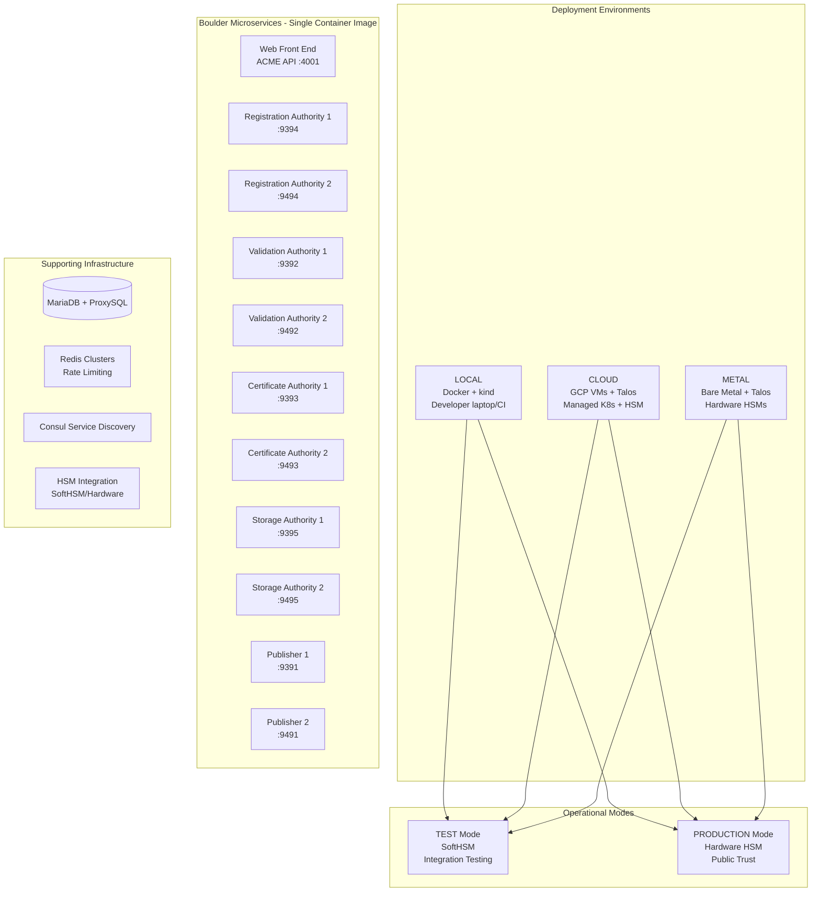
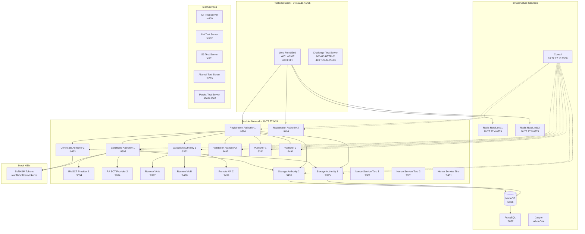

# Architecture

This document outlines the architecture for the Boulder on Kubernetes (boulder-k8s) project - a complete Infrastructure as Code (IaC) monorepo for deploying and operating WebPKI Certification Authority instances.

## 1. Introduction

This project provides a complete Infrastructure as Code monorepo that can deploy Boulder CA instances across three distinct environments:

- **LOCAL**: Developer laptop / CI environment using Docker + kind
- **CLOUD**: Cloud VM-based environment (VMs running Talos with Kubernetes)
- **METAL**: Bare-metal environment running Talos and Kubernetes

Each environment supports two operational modes:

- **TEST**: Development and integration testing with software or hardware HSMs
- **PRODUCTION**: Production deployment with hardware HSMs

## 2. Goals and Principles

- **Security First**: The system must be secure by design and default, suitable for publicly-trusted CA operations
- **Auditability**: All actions must be logged and auditable to comply with public trust requirements. The contents and history of this repository are considered part of the auditable system
- **Automation**: The entire lifecycle of the CA should be automated from deployment to maintenance
- **Portability**: The IaC must be adaptable across LOCAL/CLOUD/METAL environments
- **Modularity**: Components should be loosely coupled and independently deployable/testable
- **Test Compliance**: All changes must pass the test suite (`./test`) - this is non-negotiable

## 3. High-Level Architecture

The system is designed to run on Kubernetes and consists of Boulder microservices and supporting infrastructure.

### Core CA Software: Boulder Microservices

The core of this project is [Let's Encrypt's Boulder](https://github.com/letsencrypt/boulder), deployed as individual microservices using a **single container image** but running different Boulder commands:

- **Web Front End (WFE)**: ACME API endpoint for client interactions
- **Registration Authority (RA)**: Account and order management (2 instances for HA)
- **Validation Authority (VA)**: Domain validation logic (2 instances for HA)
- **Certificate Authority (CA)**: Certificate issuance using HSM (2 instances for HA)
- **Storage Authority (SA)**: Database operations (2 instances for HA)
- **Publisher**: Certificate transparency and publishing (2 instances for HA)
- **Remote VA**: Additional validation instances for distributed validation
- **Nonce Services**: Cryptographic nonce generation and validation

All services are deployed as separate Kubernetes Deployments using the same Boulder container image but with different command arguments and configurations.

## 4. Integration Test Environment Architecture

The Boulder CA requires a complex microservices architecture for full integration testing, based on the upstream [`boulder/docker-compose.yml`](../boulder/docker-compose.yml) configuration.

### 4.1 Service Topology

### 4.2 Critical Integration Test Requirements

1. **Service Discovery**: All Boulder services use Consul for gRPC service discovery via SRV records, as configured in [`boulder/test/consul/config.hcl`](../boulder/test/consul/config.hcl)

2. **Inter-service TLS**: All gRPC communication uses mutual TLS with certificates generated by the test PKI infrastructure in [`boulder/test/certs/`](../boulder/test/certs/)

3. **Redis Sharding**:
   - Rate limiting uses Redis instances at fixed IPs `10.77.77.4` and `10.77.77.5`

4. **SoftHSM Integration**: CA services require PKCS#11 configuration files pointing to SoftHSM token storage for cryptographic operations

5. **Network Isolation**: Three separate networks simulate different security zones:
   - `bouldernet` (10.77.77.0/24): Internal Boulder services
   - `publicnet` (64.112.117.0/25): Public-facing services
   - `publicnet2` (64.112.117.128/25): Additional public IPs for testing

6. **Challenge Resolution**: The challenge test server ([`chall-test-srv`](../boulder/test/startservers.py:285)) handles HTTP-01, DNS-01, and TLS-ALPN-01 challenges for integration tests

### 4.3 Service Startup Dependencies

Boulder services have complex dependency chains managed by [`boulder/test/startservers.py`](../boulder/test/startservers.py):

1. **Infrastructure First**: MySQL, ProxySQL, Redis instances, Consul, Jaeger
2. **Support Services**: Challenge test server, CT test server, AIA test server, S3 test server
3. **Core Boulder Services** (topologically sorted):
   - Remote VA instances (no dependencies)
   - Storage Authority instances
   - Nonce services
   - Publishers
   - Certificate Authority instances
   - Validation Authority instances
   - Registration Authority instances
   - Web Front End

## 5. Deployment Environments

The boulder-k8s monorepo supports three distinct deployment environments, each with specific characteristics and use cases:

### 5.1 LOCAL Environment

**Purpose**: Developer laptop and CI/CD environments
- **Platform**: Docker + kind (Kubernetes in Docker)
- **HSM**: SoftHSM for cryptographic operations
- **Use Cases**:
  - Local development and testing
  - CI/CD pipeline execution
  - Integration test validation
- **Deployment**: `./test` script provisions kind cluster and deploys Boulder
- **Requirements**: Docker, kind, helm

### 5.2 CLOUD Environment

**Purpose**: Cloud-based production and staging deployments
- **Platform**: VMs running Talos with managed or self-hosted Kubernetes
- **HSM**: Hardware HSMs (cloud HSM services) or SoftHSM for testing
- **Use Cases**:
  - Production CA operations
  - Staging environments
  - High-availability deployments
- **Infrastructure**: Terraform modules for cloud provider provisioning
- **Supported Clouds**: AWS, GCP, Azure

### 5.3 METAL Environment

**Purpose**: On-premises bare-metal deployments
- **Platform**: Bare-metal servers running Talos and Kubernetes
- **HSM**: Hardware HSMs (network-attached or PCIe)
- **Use Cases**:
  - Air-gapped environments
  - Maximum security requirements
  - Regulatory compliance scenarios
- **Infrastructure**: Talos configuration and Kubernetes cluster setup
- **Requirements**: Physical hardware, network HSMs

### 5.4 Operational Modes

Each environment supports two operational modes:

#### TEST Mode
- **Purpose**: Development, integration testing, and validation
- **HSM**: SoftHSM or dedicated test hardware HSMs
- **Certificates**: Test PKI hierarchy, not publicly trusted
- **Configuration**: Relaxed security policies for testing
- **Monitoring**: Enhanced debugging and verbose logging

#### PRODUCTION Mode
- **Purpose**: Live CA operations serving public certificates
- **HSM**: Hardware HSMs with proper key ceremony
- **Certificates**: Publicly-trusted PKI hierarchy
- **Configuration**: Production security policies and rate limits
- **Monitoring**: Production-grade observability and alerting

### 5.5 Environment Matrix

| Environment | TEST Mode | PRODUCTION Mode |
|-------------|-----------|-----------------|
| **LOCAL** | ✅ Developer testing with SoftHSM | ⚠️ Production simulation only |
| **CLOUD** | ✅ Staging with cloud or hardware HSM | ✅ Production with cloud or hardware HSM |
| **METAL** | ✅ Testing with hardware HSM | ✅ Production with hardware HSM |
